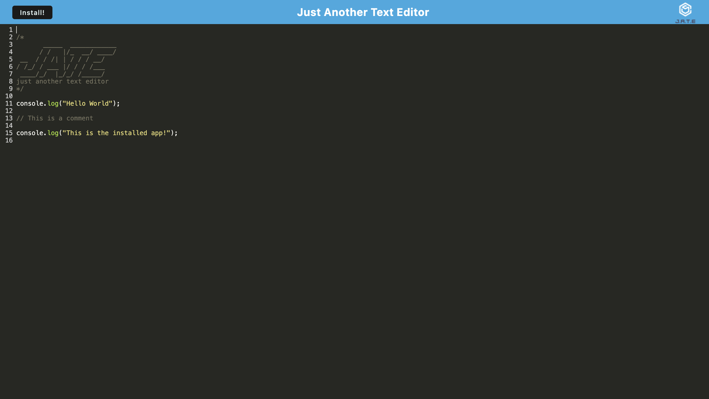

# JATE Text Editor

## Description

The JATE text editor is a simple text editor where you can write your JavaScript code, but that’s not the only thing JATE is capable of, since it is also a Progressive Web Application (PWA). JATE can be downloaded and used as a computer application, and it can be even used offline. I built this project to learn what makes a PWA a PWA. They are useful since they give the user features that could be very helpful for them. For example, the ability to use the web app without an internet connection, could be pretty handy if the user’s internet when bust, or if the user feels like working in a place with no internet connection. All in all PWAs make web apps more powerful and versatile.

## Table of Contents

- [Installation](#installation)
- [Usage](#usage)
- [Credits](#credits)
- [License](#license)

## Installation

No installation is required. You can visit the JATE Text Editor by clicking the following link: https://jate-text-editor-m53v.onrender.com

## Usage

JATE is a very simple web app to use, since the only thing you have to do to start using it is to go to its website, by clicking the following link: https://jate-text-editor-m53v.onrender.com

Once you are on JATE’s website you can type your JavaScript code, and if you want to install the web app click the “Install” button located in the header.

## Credits

- To learn about the "beforeinstallprompt" event listener:

  - Mozilla. (n.d.). BeforeInstallPromptEvent - Web APIs | MDN. BeforeInstallPromptEvent. https://developer.mozilla.org/en-US/docs/Web/API/BeforeInstallPromptEvent

- To learn about the "appinstalled" event listener:

  - MozDevNet. (n.d.). Window: appinstalled event - Web APIs | MDN. Window: appinstalled event. https://developer.mozilla.org/en-US/docs/Web/API/Window/appinstalled_event

- To learn about optional chaining:

  - Mozilla. (n.d.). Optional chaining (?.) - Javascript | MDN. Optional chaining (?.). https://developer.mozilla.org/en-US/docs/Web/JavaScript/Reference/Operators/Optional_chaining

## License

JATE Text Editor is under the MIT license.
